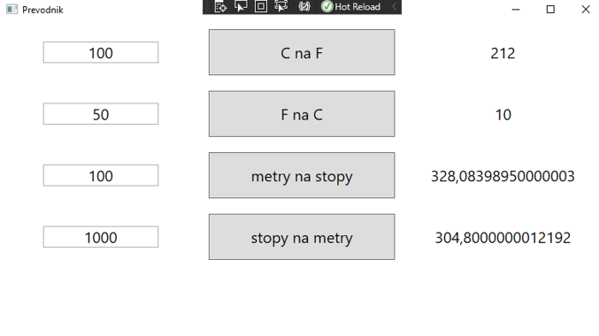

# WPF - .NET - Lab2

V tomto labu si vyzkoušíte základní možnosti umístění prvků do Gridu.
Jednoduchá aplikace umožní převádět jednotky mezi sebou z C na F a obráceně a metry na stopy a naopak.

1. Vytvořte projekt typu WPF App pro .NET 5, ne pro .NET Framework v prostředí VS 2019
1. Do základního Gridu okna MainWindow přidejte
   - 5 řádků, první čtyři budou mít výšku 80, poslední *
   - 3 sloupce, všechny stejné šířky proporčně podle celé velikosti okna (tedy každé bude mít šířku *)
1. Vložte do Gridu 4x TextBox, který bude mít nastaveno:
   - x:Name="TextRadekX", kde X bude odpovídat číslu řádku, tedy 1 až 4 
   - Grid.Row="X", kde X bude postupně 0 až 3. Grid čísluje řádky od nuly.
   - Grid.Column="0"
   - Width="150" - tím nastavíte šířku TextBoxu na pevnou hodnotu
   - HorizontalAlignment="Center", zajistí vycentrování TextBoxu v buňce Gridu
   - VerticalAlignment="Center", dtto, ale vertikální centrování
   - TextAlignment="Center", vycentruje obsah TextBoxu, tedy že čísla budou při psaní uprostřed
   - Margin="5", vytvoří okraj kolem TextBoxu
   - d:Text="100", tímto se zadá tzv. Design Time hodnota TextBoxu, aby při zobrazení okna ve VS bylo jasnější, jak to bude vypadat
   - TextWrapping="Wrap", toto zajistí, že v případě že se text nevejde do TextBoxu, přidá se další řádek a TextBox se zvětší
1. Přidejte 4x Button a nastavte mu
   - Grid.Column="1"
   - Grid.Row="X", X bude opět od 0 do 3
   - Margin="10", opět okraj kolem prvku
   - Click="PrevodCnaF", toto bude definovat metodu, která se zavolá při kliknutí na tlačítko. Uvedená hodnota bude u prvního, u dalších bude PrevodFnaC, pak PrevodMnaS a PrevodSnaM
   - IsEnabled="{Binding ElementName=TextRadekX, Path=Text.Length, Mode=OneWay}", X bude mít odpovídající hodnoty 1 až 4. Tato vlastnost zajistí, že se tlačítka Enabluje až v okamžiku, kdy v TextBoxu bude nějaká hodnota. Když Text.Length bude 0, IsEnabled bude false a tlačítko nebude použitelné.
   - Obsah elementu Button bude postupně: C na F, F na C, metry na stopy, stopy na metry
1. Přidejte 4x Label a nastavte mu
   - x:Name="VysledekRadekX", kde X bude opět 1 až 4 
   - Grid.Row="X", tentokrát opět X od 0 do 3 
   - Grid.Column="2" 
   - HorizontalAlignment="Center", opět vycentrovat v buňce Gridu 
   - VerticalAlignment="Center", taky vycentrovat v buňce Gridu 
   - Margin="5", nastavuje okraj kolem Labelu 
   - d:Content="200", nastavuje vzorový obsah, pouze pro zobrazení v Design Modu
1. Samotnému elemntu Window upravte nebo přidejte attributy
   - Title="Prevodnik", nastaví nadpis okna
   - Height="450", nastaví startovací výšku okna 
   - Width="800", nastaví startovací šířku okna 
   - FontSize="20", nastaví defaultní velikost fontu pro všechny prvky v okně, které nebudou mít vlastní velikost pro font
1. Otevřte soubor MainWindow.xaml.cs a ověřte, zda obsahuje předpis metod PrevodCnaF, PrevodFnaC, ...
1. Pokud tam tyto metody nejsou, vraťte se na MainWindow.xaml a klikněte na tlačítka, pro které chybí metoda. VS Vám metodu udělá.
1. Do každé metody dejte jako první příkaz kód (X bude odpovídat správnému číslu 1 až 4):

        if (!Double.TryParse(TextRadekX.Text, out double hodnota))
            return;
        
1. Další příkaz bude výpočet patřičného převodu, např. pro C na F to bude 
 
        double vysledek = 1.8 * hodnota + 32;
        
1. A na závěr bude kód pro zobrazení výsledku (X bude postupně 1 až 4)

        VysledekRadekX.Content = vysledek.ToString();

1. Pokud máte všechny metody zadané, můžete zkusit aplikaci otestovat a ověřit, že správně převádí jednotky.

         

         
